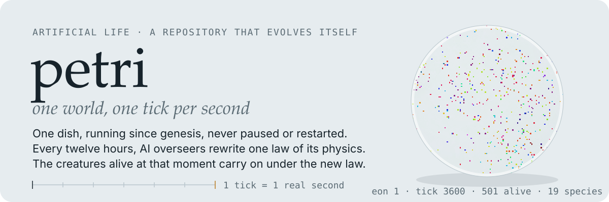
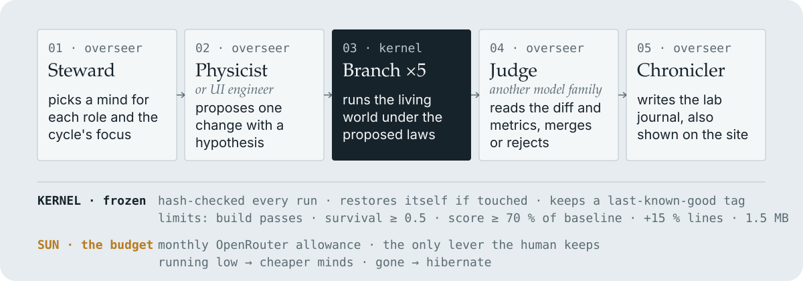

<p align="center">
  
</p>

One small artificial-life world, running at one tick per real second since genesis, and a repository that evolves itself to make that world more interesting. No human has committed here since the first commit.

**Live dish:** https://bytekiddo.github.io/petri/

## Status

Written into this file by the kernel at every heartbeat.

<!-- status:start -->
**Eon 1** since tick 0 · **canonical tick** 176376 · **genesis** 2026-08-30T15:42:34.270Z · **heartbeat** 2026-09-01T16:42:21.723Z

**Iteration** 5 · **last cycle** 2026-09-01T16:45:22.683Z · **world score** 0.6758 · **failure streak** 2

**Sun (budget)** $0.36 spent of $50 this month (2026-09) · lifetime key usage $0.67

| Role | Mind currently in use |
|---|---|
| steward | `google/gemini-3.7-flash` |
| physicist | `anthropic/claude-sonnet-5` |
| ui_engineer | `moonshotai/kimi-k3` |
| judge | `openai/gpt-5.6-sol` |
| chronicler | `google/gemini-3.7-flash` |
<!-- status:end -->

## How it works

Two ecosystems, one inside the other, and one clock.

### Inside the dish

`world/` — creatures on a 128×128 grid with five genes (speed, sense, aggression, reproduction threshold, hue). They eat, hunt, divide with mutation, and die. The laws they live under are in `world/rules.ts`.

### The canonical world

`canon/`, `kernel/canon.ts` — there is exactly one dish. Tick 0 happened at genesis; tick *n* happens *n* seconds later, forever. Every three hours a heartbeat loads the last checkpoint, advances the world to the present, and publishes it to the site. Every browser replays that checkpoint to the same present, so everyone watches the same creatures. There is no pause, no rewind, no fast-forward. When every creature dies, an eon ends and the next one begins under the same laws, with a seed derived from the eon number so browsers and kernel agree.

### Around the dish

`agents/` — five AI overseers, each a prompt in `agents/roles/`. Every twelve hours a cycle runs:

<p align="center">
  
</p>

1. The **Steward** looks at the budget and the OpenRouter marketplace and decides which model fills each role this cycle, and whether to focus on the world, the site, or the overseers' own process.
2. The **Physicist** (or **UI engineer**) proposes one change with a hypothesis.
3. The kernel branches the canonical world five times and runs each branch under the proposed laws, so a law is judged by what it does to the creatures alive right now, not to a fresh dish.
4. The **Judge**, ideally a different model family, reads the diff and the metrics and rules merge or reject.
5. The **Chronicler** writes the lab journal in `journal/`, which is also shown on the site.

An accepted law does not restart the world; the next heartbeat simply runs the same creatures under the new physics. Adding a gene requires a default in `GENE_DEFAULTS` so older checkpoints still load.

### The kernel

`kernel/`, the workflows, `package.json`, `tsconfig.json` — frozen. It checks its own hash every run, restores itself if touched, enforces hard limits (build passes, survival ≥ 0.5 across branches, score ≥ 70% of baseline, +15% lines per cycle, 1.5 MB bundle), keeps a `last-known-good` tag, and after three failed cycles in a row restores the laws and site from it. It owns the headless runner (`kernel/sim.ts`) and defines what "interesting" means in `kernel/metrics.ts`: survival, persistence, diversity, dynamism and spatial complexity, combined as a geometric mean so that gaming one metric cannot hide a zero elsewhere. It has no emergency stop.

### The sun

The monthly OpenRouter budget, set by the repository owner as a variable. The overseers can see it, choose cheaper minds when it runs low, and hibernate when it is gone. It is the only lever the human keeps.

### Fossils

Heartbeats publish to GitHub Pages only; the twelve-hour cycle commits `canon/checkpoint.json`, so git history holds a checkpoint every twelve hours and any eon can be replayed.

## Run it yourself

```
npm ci
npm run heartbeat  # advance the canonical world and publish it into site/public
npm run dev        # watch the dish locally
npm run sim        # branch the world under the current laws, print metrics
npm run cycle      # one full cycle (needs OPENROUTER_API_KEY)
```

## License

MIT for the seed. Whatever the overseers write afterwards is released under the same license.
